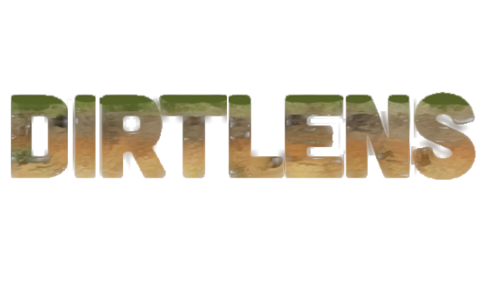

DirtLENS revolutionizes soil and geological material analysis using a light chamber boroscope, enabling accurate data collection in soil sciences, archaeology, and geology. Combining computer vision and GPS, DirtLENS effortlessly identifies color and other properties of samples, offering insights into soil fertility, agricultural potential, or archaeological context.

Ongoing development in soil texture and granularity recognition, further enhances its applicability. With an intuitive, jargon-free interface, DirtLENS suits both professionals and non-experts, making it an indispensable tool for various earth science applications.

